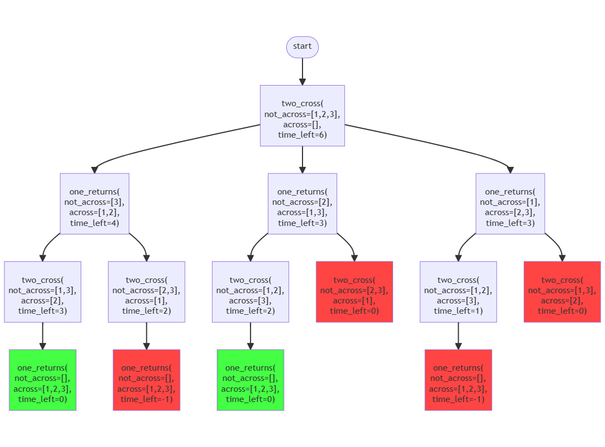

# Escape from Zurg: An Implementation in Python

## Overview

"Escape from Zurg" is a puzzle described in [Escape from Zurg: An Exercise in Logic Programming](https://web.engr.oregonstate.edu/~erwig/papers/Zurg_JFP04.pdf) in which the author compares two solutions, one in Prolog and one in Haskell, to see if functional programming languages are effective for search problems. Inspire by this, my project compares the author's Haskell solution to my own Python solution in terms of language features, readability, and performance. Python has a mix of imperative, functional, and OOP features that make for an interesting comparison.

&nbsp;

## Implementation

I met all the objectives laid out in my project proposal. I implemented the "Escape from Zurg" puzzle in Python and then used appropriate testing and profiling to optimize my solution for readability and performance. Finally, I compared my solution to the Haskell solution (see the "Conclusions" section at the end).

In `zurg.py`, I implemented a depth-first search using indirect recursion. `zurg()` defines the puzzle parameters and initiates the solution by calling `two_cross()`. `two_cross()` finds all the possible pairs that could cross and calls `one_returns()` for each. `one_returns()` calls `two_cross()` once for each toy that has crossed and could return. The recursion continues until each branch terminates, either because the "time limit" for the toys to cross the bridge has expired or because a solution has been found.

My solution is generalized and is not confined to the exact "Escape from Zurg" puzzle parameters. Calling `two_cross()` directly, instead of calling `zurg()`, allows you to input custom search parameters. For an example of this, see `TestTwoCross::test_recursive_case_with_time_limit` in `zurg_test.py`. Below is a chart that illustrates this test case visually. Red nodes represent time limit terminations while green nodes represent solutions found.

<center></center>

<div style="page-break-after: always;"></div>


## Testing

To run the "Escape from Zurg" solution, call `make run`. To run the full test suite, run `make test`. To run the tests follow by the solution, run `make`. To run profiling, call `make profile`. Most of the available `make` commands have dependencies, especially `profile`.

Within `zurg_test.py` there are system, integration, and unit tests. The `TestZurg` class contains system tests that ensure the solution matches the expected output, derived from [ZurgDirect.hs](https://web.engr.oregonstate.edu/~erwig/zurg/). These are black box tests, as they do not require knowledge of the implementation, just knowledge of the output format.

The `TestTwoCross` and `TestOneReturns` classes contain a mixture of integration and unit tests, where integration tests test the interplay between multiple user defined functions (in this case, `two_cross()` and `one_returns()`), and unit tests test a single user defined function in isolation. Due to the indirectly recursive nature of both `two_cross()` and `one_returns()`, both integration and unit tests make one function call. The distinction is in the behavior triggered by the input parameters. All the `recursive_case` tests are integration tests. Most of the `termination_case` tests are unit tests, with the exception of `TestTwoCross::test_termination_case_solution_found`.

The tests in `TestTwoCross` and `TestOneReturns` are gray box tests. They only need knowledge of the output format for the test cases but need implementation knowledge to distinguish between integration and unit tests.

`zurg_profiling.py` profiles the RAM usage and runtime (Haskell vs Python, interpreted vs compiled) as the input size (number of toys) increases. To accentuate runtime trends, the time limit is set high enough to make every solution valid. The results are discussed in the "Conclusions" section.

&nbsp;


## Listing

### Files
* `docs/`
  * `example.mer` and `example.png`: Flow of `zurg.py`, given a simplified puzzle.
  * `ram.png` and `runtime.png`: Profiling results.
  * `ZURG.md`: Docs for `zurg.py`.
* `tests/`
  * `zurg_profile.py`: Generates `ram.png` and `runtime.png`.
  * `zurg_test.py`: Test suite for `zurg.py`.
  * `Zurg.hs` and `Search.hs`: [Generic Haskell solution](https://web.engr.oregonstate.edu/~erwig/zurg/), modified for runtime profiling.
  * `ZurgDirect.hs`: [Puzzle specific Haskell solution](https://web.engr.oregonstate.edu/~erwig/zurg/) for ground truth.
* `Makefile`: `make` commands to `run` the puzzle, `test` and `profile` the code, and generate the `docs`.
* `README.md` and `README.pdf`: This file.

<div style="page-break-after: always;"></div>

### Functions (`zurg.py`)

```python
def zurg() -> List[list]
```

Solves the "Escape from Zurg" puzzle.

**Returns**:

`List[list]`: A list of solutions

```python
def two_cross(not_across: List[int], across: List[int], time_left: int,
              accumulator: list) -> List[list]
```

Splits the search problem by every pair of toys that could cross the bridge. Terminates early if the time limit for getting all the toys across the bridge is met.

**Arguments**:

- `not_across` (`List[int]`): Toys not yet across the bridge
- `across` (`List[int]`): Toys across the bridge
- `time_left` (`int`): Time left to get all the toys across the bridge
- `accumulator` (`list`): Partial solution being explored

**Returns**:

`List[list]`: A list of solutions

```python
def one_returns(not_across: List[int], across: List[int], time_left: int,
                accumulator: list) -> List[list]
```

Splits the search problem by every toy that could return across the bridge with the flashlight. Terminates early if the time limit for getting all the toys across the bridge is exceeded. Also terminates if all the toys are across the bridge.

**Arguments**:

- `not_across` (`List[int]`): Toys not yet across the bridge
- `across` (`List[int]`): Toys across the bridge
- `time_left` (`int`): Time left to get all the toys across the bridge
- `accumulator` (`list`): Partial solution being explored

**Returns**:

`List[list]`: A list of solutions

<div style="page-break-after: always;"></div>


## Conclusions

